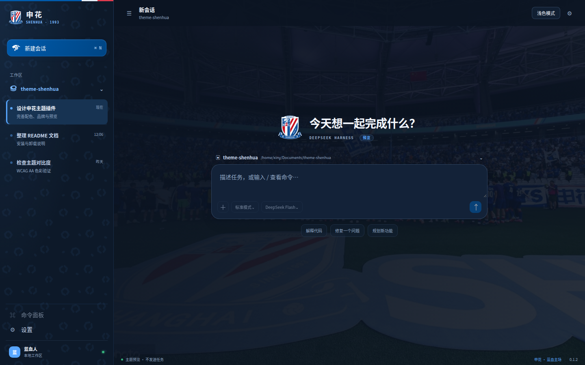
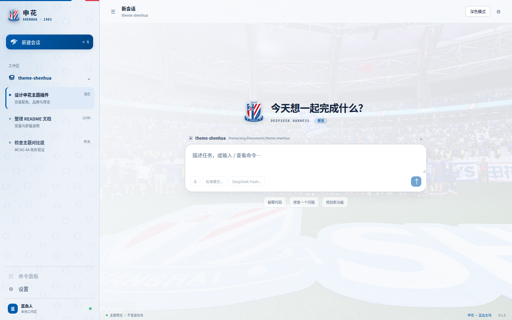

# 申花 · 蓝血主场

一个为 DeepSeek Harness Web UI 制作的上海申花主题插件。它通过 Harness 的主题 token 和品牌插槽提供「主场之夜」深色方案、「蓝白看台」浅色方案、侧栏字标与欢迎页球场纹理。

主题沿用 Harness 原有的 **Light / Dark / System** 外观设置；安装后无需新增切换器。它不会修改模型、提示词、工具或会话数据。

## 预览

当前预览直接加载 `lib/client.js`，复用插件的实际配色、品牌组件与侧栏样式。执行 `pnpm build` 后，在项目目录运行 `python3 -m http.server 4176 --bind 127.0.0.1`，打开 `http://127.0.0.1:4176/preview/`；右上角可切换深浅色、打开设置弹窗，左上角可折叠侧栏。预览使用示例会话，快捷操作可填写输入框，新建会话可清空输入；输入框不会发送任务。

以下截图由 v0.1.2 的实际浏览器 bundle 生成，展示当前图标、背景和响应式布局。

| 主场之夜 | 蓝白看台 |
| --- | --- |
|  |  |

窄屏折叠状态见 [`screenshots/shenhua-narrow-dark.png`](screenshots/shenhua-narrow-dark.png)。主题曾在真实 Harness Web 页面完成加载验证；当前侧栏与图标调整已在复用浏览器 bundle 的预览中检查。

## 安装

要求 Node.js 22.19 或更高版本、pnpm，以及 DeepSeek Harness `0.1.5-rc.1` 或兼容版本；真实 Web 页面验证使用 `0.1.5-rc.2`。

从源码安装：

```sh
pnpm install
pnpm build
dsh plugin --profile web add "link:$(pwd)"
dsh --profile web
```

也可以安装打包产物：

```sh
pnpm build
pnpm pack --pack-destination dist
dsh plugin --profile web add ./dist/dsh-theme-shenhua-0.1.2.tgz
```

从 GitHub Release 下载 `dsh-theme-shenhua-0.1.2.tgz` 后，可以直接安装，无需解压：

```sh
dsh plugin --profile web add ./dsh-theme-shenhua-0.1.2.tgz
dsh --profile web
```

打开 Harness 的 **Settings → General → Appearance**，选择 Light、Dark 或 System。

## 停用、卸载与升级

卸载主题并恢复 Harness 原有配色和品牌组件：

```sh
dsh plugin --profile web remove dsh-theme-shenhua
```

链接式源码安装在重新执行 `pnpm build` 后即可取得最新产物。tarball 安装请先打出新包，再执行：

```sh
dsh plugin --profile web update ./dist/dsh-theme-shenhua-0.1.2.tgz
```

## 开发验证

```sh
pnpm build
pnpm check
pnpm release:check
```

`pnpm check` 会先重建产物，避免测试误用旧 bundle。配色测试覆盖 Harness 的必需主题 token、light/dark 成对值、正文 4.5:1 对比度、关键状态色 3:1 对比度，以及浏览器 bundle 的挂载与完整卸载。`0.1.5-rc.2` 的真实 Web 页面已验证浅色欢迎页、品牌组件和本地图片加载；发布前仍建议回归长对话、代码块、工具结果、弹窗、窄屏与右侧面板。

浏览器回归：启动上述预览服务器后打开 `http://127.0.0.1:4176/tests/layout.html`。覆盖 1280×720、390×844、320×568、900×480 四种视口的深浅色、设置弹窗命中检测、关闭后恢复操作、侧栏折叠与预览输入；负向对照会临时恢复旧版层叠限制，确认检查能发现设置遮挡。

## 本轮修复

- 去掉侧栏与欢迎区额外的层叠隔离，修复挂在侧栏内部的设置弹窗被主区域盖住的问题。
- 球场背景改为欢迎页自身的背景绘制，取消越界装饰元素和输入区域的额外裁剪。
- CSS 随插件 effect 挂载和清理，停用后不再残留；重复挂载共用样式，最后一个实例退出后移除。
- 品牌图标遵守宿主传入的尺寸，不再强行撑大侧栏和欢迎页插槽。
- 预览修复窄屏侧栏开关与实际显示不一致，并补上可操作的设置弹窗。

## 设计说明

- 主色采用设计用申花蓝 `#005BAC`，红色点缀采用 `#E33446`；它们不是俱乐部官方发布的标准色值。
- 保留本地申花主场照片，以柔和遮罩融入欢迎页背景；照片来源以 `NOTICE.md` 为准，运行时不请求图片或字体服务。
- 侧栏增加蓝白红细条、渐变主按钮与选中指示；欢迎页与侧栏品牌保留申花队徽，新建会话使用从队徽提取的侧面咆哮豹头，工作区使用八万人体育场的斜俯视全景剪影，以实心环形顶棚、偏心开口和看台外墙表现外观，侧栏加入低对比度豹纹，保留原有操作名称、状态提示和行为。
- 浅色采用雾蓝侧栏与白色输入卡，深色采用海军蓝分层；输入框提供清晰的聚焦边框。
- 队徽、队徽豹头、球场图标、豹纹与球场背景在构建时内联进浏览器 bundle，离线环境也能正常显示。
- 安装层会停用 Harness 的官方侧栏品牌占位，由申花队徽和字标接管；卸载主题后该补丁撤销，官方品牌恢复。

## 许可与球迷共建

自 v0.1.1 起，代码、CSS 和文档采用 **MPL-2.0**：对外分发受覆盖文件的修改时，需按协议提供对应源码。MPL 允许商业使用；不要求独立宿主或不含本项目代码的新文件整体开源。

原创球场、豹纹 SVG 采用 **CC BY-NC-SA 4.0**：署名、限非商业用途、分享改编作品时遵守相同方式共享条件。安装包附带源码、构建文件和完整协议。

队徽、队徽豹头、比赛照片及截图中的第三方权利不由本项目再授权，当前仓库也未提供其完整再分发授权证据。非官方声明、非商业用途或更换协议不能代替授权。

**旧版 v0.1.0 已授出的 MIT 权利仍有效**，包括旧版相同代码和原创图形；本次更改不追溯撤销这些权利。完整主题包含非商业和第三方素材，不应作为整体宣称可自由商用。

详见 [许可范围](LICENSING.md)、[MPL 正文](LICENSE)、[素材声明](NOTICE.md) 和 [贡献说明](CONTRIBUTING.md)。
