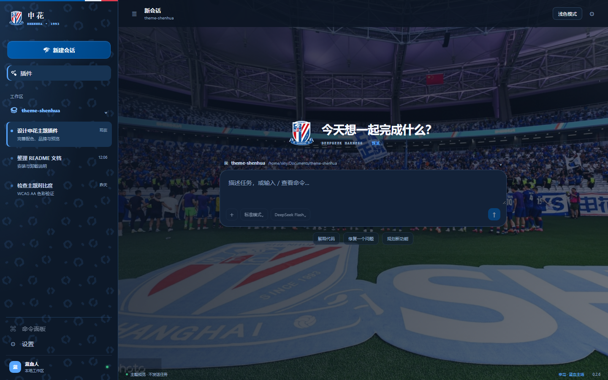
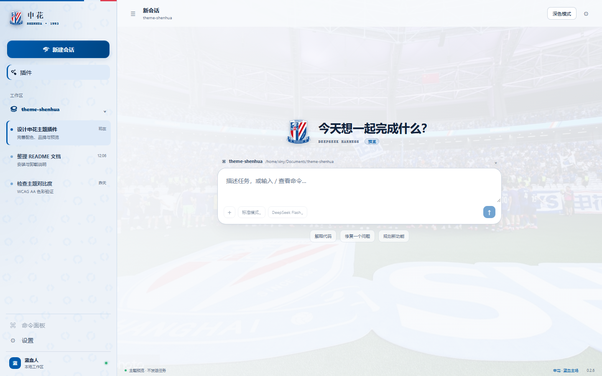

# 申花 · 蓝血主场

一个为 DeepSeek Harness Web UI 制作的上海申花主题插件。它通过 Harness 的主题 token 和品牌插槽提供「主场之夜」深色方案、「蓝白看台」浅色方案、侧栏字标与欢迎页球场纹理。

主题沿用 Harness 原有的 **Light / Dark / System** 外观设置；安装后无需新增切换器。它不会修改模型、提示词、工具或会话数据。

## 预览

当前预览直接加载 `lib/client.js`，复用插件的实际配色、品牌组件与侧栏样式。侧栏按钮沿用 Harness 0.2.0 的真实 DOM（`_newSessionLabelMask` / `_newSessionContent` 居中盒），因此预览与实机版式一致。执行 `pnpm build` 后，在项目目录运行 `python3 -m http.server 4176 --bind 127.0.0.1`，打开 `http://127.0.0.1:4176/preview/`；右上角可切换深浅色、打开设置弹窗，左上角可折叠侧栏。预览使用示例会话，快捷操作可填写输入框，新建会话可清空输入；输入框不会发送任务。

以下截图由实际浏览器 bundle 生成，展示当前图标、背景和响应式布局。

| 主场之夜 | 蓝白看台 |
| --- | --- |
|  |  |

窄屏折叠状态见 [`screenshots/shenhua-narrow-dark.png`](screenshots/shenhua-narrow-dark.png)。主题曾在真实 Harness Web 页面完成加载验证；当前侧栏与图标调整已在复用浏览器 bundle 的预览中检查。

## 安装

要求 Node.js 22.19 或更高版本、pnpm，以及 DeepSeek Harness `0.1.5` / `0.2.0-rc`（支持 Windows 桌面安装包 EXE 及 CLI）。

> [!NOTE]
> **换了电脑（或刚拉下这个目录）时先构建一次。** `lib/` 与 `dist/` 都是构建产物，不随版本库提供，需要在本机生成：
>
> ```sh
> pnpm install     # 安装构建依赖（唯一需要联网的一步）
> pnpm build       # 产出 lib/client.js 等运行文件，预览也依赖它
> pnpm pack:local  # 产出 dist/dsh-theme-shenhua-<version>.tgz，用来装进 Harness
> pnpm check       # 可选：类型检查 + 9 项回归测试
> ```
>
> 之后按下面的方式把这个 tgz 装进 Harness 即可。`node_modules/` 不必从旧机器拷贝。

> [!NOTE]
> **桌面客户端（exe 安装版）用户请注意**：
> 最新版 DeepSeek Harness 官方桌面安装包使用的是独立运行配置 **`desktop` profile**（位于 `~/.dsh/profiles/desktop/`），而非旧版命令行的 `web` profile。若此前安装过旧版插件，升级到 exe 后需安装至 `desktop` profile。

### 1. 最新桌面客户端（exe 安装包）

> [!IMPORTANT]
> **关于 `profile "desktop" is managed exclusively by the Electron application` 报错**：
> 官方为了保护桌面端配置，**禁止外部全局 `dsh` CLI 直接修改 `desktop` profile**。安装时请使用以下两种方法之一：

#### 方法 A：桌面端图形界面添加（推荐）
1. 打开 DeepSeek Harness 桌面客户端，点击左侧边栏的「**插件 (Plugins)**」图标；
2. 点击右上角的「**添加插件**」(Add Plugin) 按钮；
3. 输入打包文件或目录的绝对路径，例如：
   ```text
   C:\Users\xdani\Documents\dsh-shenhua-theme\dist\dsh-theme-shenhua-0.2.6.tgz
   ```
4. 点击确认安装，安装完成后点击「**立即启用**」(Enable Now) 即可实时生效。

#### 方法 B：使用桌面版内置的专属 CLI 执行
使用 Electron 安装目录内自带的 `dsh.cmd`（自带桌面 profile 管理权限）：

```powershell
& "$env:LOCALAPPDATA\Programs\DeepSeek Harness\resources\runtime\cli\bin\dsh.cmd" plugin --profile desktop add C:\Users\xdani\Documents\dsh-shenhua-theme\dist\dsh-theme-shenhua-0.2.6.tgz
```

### 2. Web Profile（命令行与无头环境）

针对传统 Web profile 环境：

```sh
# 安装打包产物
pnpm build
pnpm pack:local
dsh plugin --profile web add ./dist/dsh-theme-shenhua-0.2.6.tgz
dsh --profile web

# 或源码安装
dsh plugin --profile web add "link:$(pwd)"
dsh --profile web
```

打开 Harness 的 **Settings → General → Appearance**，选择 Light、Dark 或 System 即可在深浅色之间随心切换。

## 停用、卸载与升级

从桌面客户端卸载并恢复官方默认外观：

```sh
dsh plugin --profile desktop remove dsh-theme-shenhua
```

若使用的是 Web profile：

```sh
dsh plugin --profile web remove dsh-theme-shenhua
```

升级已安装的 tarball：

```sh
# 桌面版升级
dsh plugin --profile desktop update ./dist/dsh-theme-shenhua-0.2.6.tgz

# Web 版升级
dsh plugin --profile web update ./dist/dsh-theme-shenhua-0.2.6.tgz
```

## 开发验证

```sh
pnpm build
pnpm check
pnpm release:check
```

`pnpm check` 会先重建产物，避免测试误用旧 bundle。配色测试覆盖 Harness 的必需主题 token、light/dark 成对值、正文 4.5:1 对比度、关键状态色 3:1 对比度，以及浏览器 bundle 的挂载与完整卸载。

浏览器回归：启动上述预览服务器后打开 `http://127.0.0.1:4176/tests/layout.html`。覆盖 1280×720、390×844、320×568、900×480 四种视口的深浅色、设置弹窗命中检测、关闭后恢复操作、侧栏折叠与预览输入。

## 本轮修复与升级

- 适配 DeepSeek Harness 0.2.0-rc 及全新 Windows 桌面客户端（exe 安装版），提供 `desktop` profile 安装支持与说明。
- 声明中补齐 `@deepseek-ai/dsh-client-ui-workspace` 依赖注入，适配新版工作区与会话树独立拆包结构。
- 放宽 `@deepseek-ai/cordis` 依赖范围至 `^4.0.0`，全面兼容 0.2.0 内置的 Cordis 4.0.4+。
- 完善桌面客户端内置「插件 (Plugins)」界面与热重载生命周期支持。
- 修复侧栏「新建会话」按钮错位：改为在宿主的 `_newSessionContent` 居中盒内替换图标，原生「+」图标不再残留，图标与文字重新居中，右下角快捷键不再被裁切。
- 折叠态改用宿主几何：Windows 标题栏保持 28px 圆形图标按钮，窄栏保持 36px 幽灵按钮，不再溢出标题栏。
- 去掉侧栏与欢迎区额外的层叠隔离，修复挂在侧栏内部的设置弹窗被主区域盖住的问题。
- 球场背景改为欢迎页自身的背景绘制，取消越界装饰元素和输入区域的额外裁剪。
- CSS 随插件 effect 挂载和清理，停用后不再残留；重复挂载共用样式，最后一个实例退出后移除。
- 品牌图标遵守宿主传入的尺寸，不再强行撑大侧栏和欢迎页插槽。

## 设计说明

- 主色采用设计用申花蓝 `#005BAC`，红色点缀采用 `#E33446`；它们不是俱乐部官方发布的标准色值。
- 保留本地申花主场照片，以柔和遮罩融入欢迎页背景；照片来源以 `NOTICE.md` 为准，运行时不请求图片或字体服务。
- 侧栏增加蓝白红细条、渐变主按钮与选中指示；欢迎页与侧栏品牌保留申花队徽，新建会话使用从队徽提取的侧面咆哮豹头，工作区使用八万人体育场的斜俯视全景剪影，以实心环形顶棚、偏心开口和看台外墙表现外观，侧栏加入低对比度豹纹，保留原有操作名称、状态提示和行为。
- 浅色采用雾蓝侧栏与白色输入卡，深色采用海军蓝分层；输入框提供清晰的聚焦边框。
- 队徽、队徽豹头、球场图标、豹纹与球场背景在构建时内联进浏览器 bundle，离线环境也能正常显示。
- 安装层会停用 Harness 的官方侧栏品牌占位，由申花队徽和字标接管；卸载主题后该补丁撤销，官方品牌恢复。

## 许可与球迷共建

自 v0.1.1 起，代码、CSS 和文档采用 **MPL-2.0**：对外分发受覆盖文件的修改时，需按协议提供对应源码。MPL 允许商业使用；不要求独立宿主或不含本项目代码的新文件整体开源。

原创球场、豹纹 SVG 采用 **CC BY-NC-SA 4.0**：署名、限非商业用途、分享改编作品时遵守相同方式共享条件。安装包附带源码、构建文件和完整协议。

队徽、队徽豹头、比赛照片及截图中的第三方权利不由本项目再授权，当前仓库也未提供其完整再分发授权证据。非官方声明、非商业用途或更换协议不能代替授权。

**旧版 v0.1.0 已授出的 MIT 权利仍有效**，包括旧版相同代码和原创图形；本次更改不追溯撤销这些权利。完整主题包含非商业和第三方素材，不应作为整体宣称可自由商用。

详见 [许可范围](LICENSING.md)、[MPL 正文](LICENSE)、[素材声明](NOTICE.md) 和 [贡献说明](CONTRIBUTING.md)。
